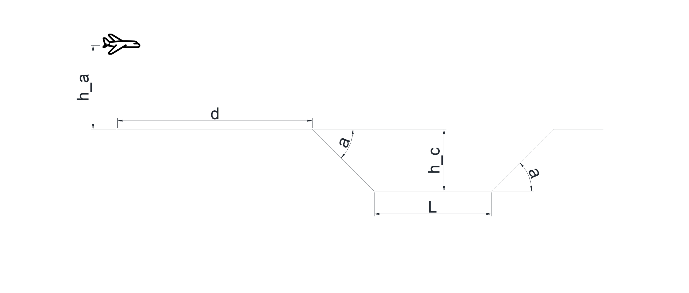

# Proyecto Métodos Numéricos

## Integrantes
- **Adrian Correa**  
- **Stiv Quishpe**  
- **Ian Oñate**   
- **Jorge Yanez**

## Descripción
Un avión vuela con velocidad $V$ a $H_a$ metros del suelo en dirección a un cañón, como se muestra en la figura.  

El cañón tiene forma de trapecio isósceles invertido, con una altura $H_c$, un largo $L$ y un ángulo $\\alpha$ con respecto al horizonte.  
Cuando el avión se encuentra a una distancia $d$, el cañón suelta una bomba.  

## Objetivo
- Graficar la trayectoria de la bomba y mostrar el punto donde impacta, ya sea este dentro o fuera del crater.

## Informe del Proyecto
Accede al informe del proyecto atraves del siguiente enlace

## Descripcion codigo
Este código simula la trayectoria de una bomba lanzada desde un avión en vuelo sobre un terreno con un cráter. Usa una interfaz gráfica para ingresar parámetros como la altura del avión, el ángulo del cráter, y la velocidad inicial de la bomba. Luego, genera una animación que muestra el movimiento del avión y la caída de la bomba, detectando colisiones con el terreno y las paredes del cráter.

## Presentacion del Proyecto

## Video de presentacion 
Hacer click en la imagen para ver el video
    
